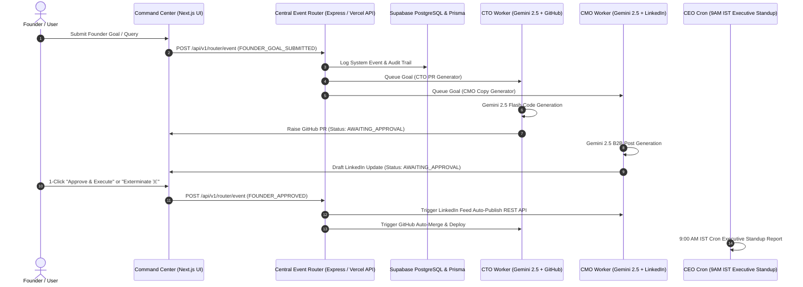

# ⚡ Project SparkHQ: The Autonomous AI C-Suite for Solo Founders

[](https://opensource.org/licenses/MIT)
[](https://vercel.com)
[](https://github.com/Philioraptor/SparkHQ)

Project SparkHQ is an **Autonomous, Multi-Repo AI C-Suite** engineered specifically for single founders and solopreneurs scaling standard operations to 100x speed. 

It eliminates open-ended agent chat loops by replacing them with **Strict 1-Click Binary Approvals**, **Multi-Repo Router Event Queues**, **Self-Healing Bug Fix Loops**, an interactive **Vault AI Chat Agent**, and **BYOK (Bring Your Own Keys)** personal credential isolation.

---

## 🏛️ System Architecture Diagram



---

## ⚡ Core Features

- **🐙 CTO Agent Worker**: Automatically generates real GitHub Pull Requests (`@google/genai` + `@octokit/rest`).
- **📱 CMO Agent Worker**: Generates viral B2B LinkedIn updates & auto-posts to feed upon 1-click approval.
- **📊 CEO Executive Standup**: 9:00 AM IST daily automated executive summary report.
- **🤖 Vault AI Chat Agent**: Natural language chat interface for parsing & storing Gemini, GitHub, LinkedIn, & OpenAI API keys into your isolated browser vault.
- **🛡️ Founder Security Guard**: Protected with Chairman Passcode (`48182122`) & multi-tenant user authentication.
- **☠️ Task Exterminator**: 1-Click task cancellation & queue purging.
- **☕ Buy Me a Coffee Support**: Open source support powered by Razorpay Live production gateway (`rzp_live_TMBqGRFBGmtaMH`).

---

## 🚀 Quickstart Local Setup

1. **Clone the Repository**:
   ```bash
   git clone https://github.com/Philioraptor/SparkHQ.git
   cd SparkHQ
   ```

2. **Install Dependencies**:
   ```bash
   npm install
   ```

3. **Configure Environment Variables**:
   Copy `.env.example` to `.env`:
   ```bash
   cp .env.example .env
   ```

4. **Generate Database Schemas**:
   ```bash
   npm run prisma:generate
   ```

5. **Start Development Server**:
   ```bash
   npm run dev:command-center
   ```
   Open `http://localhost:3000` in your browser.

---

## 📄 License

Project SparkHQ is licensed under the **[MIT License](LICENSE)**. 

Copyright (c) 2026 Dhruv Mishra & Project SparkHQ Contributors.

Free for personal and commercial use!
